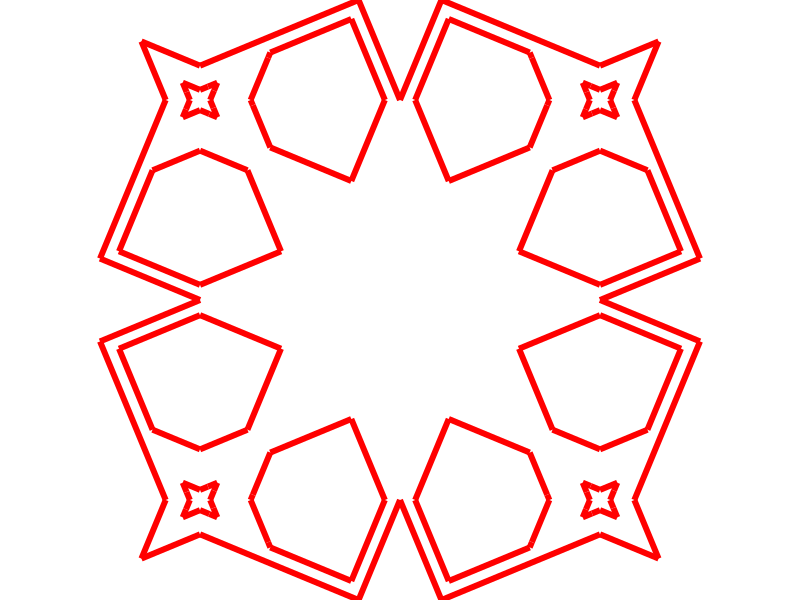
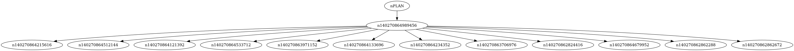
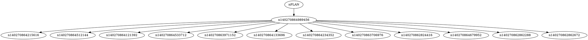
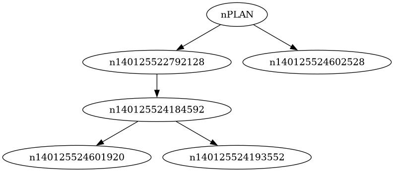

# Projet d'algo : le decoupeur, partie 2.

Bienvenue dans la seconde partie du projet d'algo.

## Fichiers fournis

On vous fournit ici un nouveau jeu de fichiers:

- minigeo/polygone.py
- minigeo/doublons.py
- minigeo/classification.py

Vous pouvez aussi bien partir des nouveaux fichiers donnés que
les intégrer dans votre projet version 1.

Le fichier *decoupe.py* a été légèrement modifié pour passer à la suite du projet.
Il prend maintenant trois arguments :

- le fichier stl binaire
- l'épaisseur des tranches
- un numéro de tranche à traiter

Le code fourni charge le stl, le découpe (avec un mauvais algorithme) et lance la fonction *traitement_tranche* sur 
la tranche cible. Celle-ci supprime les parties de segments en double
(comme vu en TD) et construit les polygones de la tranche (comme vu en amphi).

## Travail demandé

On vous demande de réaliser la classification des polygones sous forme d'arbre d'inclusion en complétant le fichier *minigeo/classification.py*.
Vous devez :

- écrire la classe *Noeud* et toutes les méthodes qui vous paraissent utiles. Le contenu d'un noeud est soit une chaine de caractères
contenant le mot "PLAN" pour la racine de l'arbre, soit un polygone pour les autres noeuds.
- écrire la fonction arbre d'inclusion qui prend en entrée un ensemble de polygones et renvoie l'arbre d'inclusion. Tout contenu de noeud 
doit contenir tous ses descendants. On vous fournit une méthode *contient* sur la classe *Polygone* qui pourrait vous servir ou vous inspirer.
- compléter la méthode 'affichage' qui réalise une conversion de l'arbre en fichier graphviz (dot) puis en png et l'affiche dans kitty.

On prendra en compte dans la notation la complexité **au pire cas** de votre algorithme de classification mais même un algorithme naif
permet d'avoir la moyenne.

Pour avoir une idée de ce que l'on attend, voici ce que j'obtiens sur la 9ème tranche
du fichier *cordoba.stl* avec une épaisseur de 0.1 :

./decoupe.py stl/cordoba.stl 0.1 9

segments:

polygones:

arbre:

Vous pouvez également jeter un coup d'oeil au code *dot* de l'arbre :

Le fichier *classification.py* possède également un petit exemple de test qui donne les résultats suivants :

polygones:

arbre:

## Rendu

On vous demande de rendre tous les fichiers python de votre projet (afin que l'on puisse lancer des tests) ainsi qu'un mini rapport d'une page.
Votre rapport doit expliquer rapidement votre algorithme et le calcul de son coût au pire cas. Les correcteurs doivent être en mesure de vérifier
le calcul du coût.

