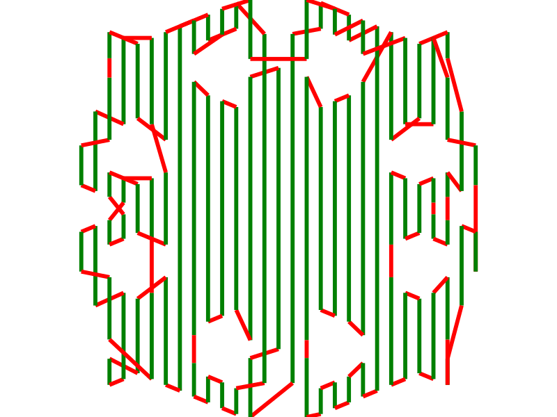

# Projet d'algo : le decoupeur, partie 3.

Bienvenue dans la dernière partie du projet d'algo.

## Fichiers fournis

On vous fournit ici un nouveau fichier:

- minigeo/polygone_a_trous.py

en plus de cela, la classe `Polygone` a été étendue par une nouvelle méthode `detection_points_decoupe`,
le fichier principal (`decoupe.py`) a été complété, ainsi que le module `minigeo/classification.py`.

Vous pouvez aussi bien partir des nouveaux fichiers donnés que
les intégrer dans votre projet version 2.

Le fichier *decoupe.py* a été légèrement modifié pour passer à la suite du projet.
Il prend maintenant quatres arguments :

- le fichier stl binaire
- l'épaisseur des tranches
- la largeur de la buse d'impression
- un numéro de tranche à traiter

Le code fourni charge le stl, le découpe (avec un mauvais algorithme) et lance la fonction *traitement_tranche* sur 
la tranche cible. Celle-ci supprime les parties de segments en double
(comme vu en TD) et construit les polygones de la tranche (comme vu en amphi).
On crée ensuite un arbre d'inclusion (comme vu en amphi), qui est transformé en polygones à trous puis chaque polygone est rempli
par des segments.
À la fin de la fonction `traitement_tranche` la variable `segments` contient tous les segments sur lesquels la buse doit passer dans
la tranche.

## Travail demandé

On vous demande de terminer l'algorithme en calculant le chemin passant par tous les segments de remplissage.

Pour cette dernière étape, on regarde notre ensemble de segments comme un graphe. Chaque extrémité de segment est un sommet et
chaque segment une arète. Dans l'état actuel, le graphe n'est pas connexe. On vous demande de rendre le graphe connexe ET de rendre le degré
de chaque sommet **pair**. Une fois cette étape réalisée il suffit alors de terminer en calculant un [cycle eulérien](https://fr.wikipedia.org/wiki/Graphe_eul%C3%A9rien).

polygone a trous : 
graphe initial : 
graphe complété : 

Sur le dessin ici le graphe initial apparait en vert et les arètes ajoutées en rouge.

La fonction `traitement_tranche` doit terminer en jouant l'animation du parcours dans le terminal en réalisant un appel à `affiche` pour toutes les slices
du tableau contenant le cycle eulérien. Les correcteurs doivent être en mesure de vérifier votre algorithme facilement en regardant votre animation.

Voir par exemple le fichier `animation.gif` (vous n'êtes pas obligé de faire votre animation en couleur).

## Rendu

On vous demande de rendre tous les fichiers python de votre projet (afin que l'on puisse lancer des tests) ainsi qu'un rapport entre 2 et 5 pages.
Votre rapport concerne l'ensemble de votre projet. Il contiendra une partie d'analyse théorique et une partie expérimentale. Pour la partie expérimentale, vous n'êtes
pas obligés de tester toutes les étapes de l'algorithme mais vous pouvez mettre en valeur vos différentes optimisations. On ne vous demande pas les meilleurs
algorithmes mais racontez nous quelque chose d'intéressant. Les idées originales sont les bienvenues. 
Vous devez également nous rendre en plus du code source les scripts utilisés pour vos expériences.

